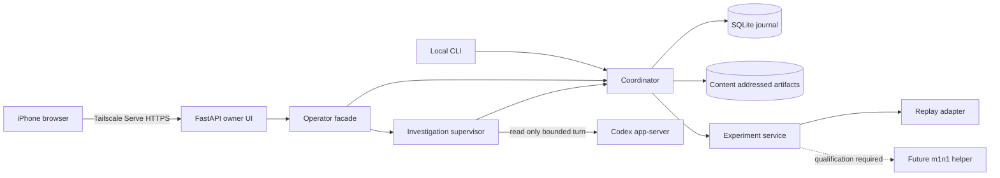

# Architecture

M1 Power Lab is one Python application on the Linux host with two narrow
external boundaries: Codex app-server and the hardware adapter.

## Authority

- The coordinator owns durable session state, budgets, reviews, approvals,
  dispatch intent and outcome reconciliation.
- Codex receives bounded technical evidence and returns proposals. It cannot
  approve work or call the hardware adapter.
- The experiment service accepts only an exact authorized envelope and maps
  each operation to a bounded typed adapter call.
- Each typed dispatch carries its coordinator operation ID, exact procedure and
  accepted review digests, artifact digests, target/boot/configuration identity,
  deadline, and approval scope. A versioned bounded JSON codec is available for
  a separate helper process; it rejects unknown operations and fields. Stream
  transports wrap each JSON message in a four-byte big-endian payload length;
  incomplete frames and trailing bytes fail closed. The blocking stream
  helpers handle short reads and writes; a transport caller must enforce its
  deadline. The experiment service also checks the adapter's operation ID and
  response timing, preserving late results as evidence while recording their
  effects as unknown.
- The current build accepts only `ReplayHardwareAdapter`. The m1n1 adapter is
  an unavailable object that opens no device.
- The helper codec does not open USB or serial devices. The helper process,
  exclusive physical interface ownership, and transport recovery remain
  unqualified until the ThinkPad inventory and recovery path are recorded.
- The browser submits an idempotent command ID and expected session revision.
  It never talks to SQLite, Codex or a device directly.

## Investigation loop

1. Record a target snapshot and technical evidence.
2. Admit a bounded, read only Codex job against an evidence manifest.
3. Store hypotheses and proposed experiments as immutable evidence.
4. Promote a proposal to an exact typed procedure.
5. Complete an independent review for that procedure revision.
6. Ask the owner for exact scoped approval when an operation can mutate state.
7. Recheck session, target, boot epoch, configuration, review, approval and
   budget immediately before dispatch.
8. Store each result and any partial evidence, then record the final or unknown
   effect explicitly.
9. Feed compact records plus requested raw technical excerpts into the next
   Codex turn.

## Scientific boundary

Exploration and confirmation are separate records. Confirmation freezes its
protocol before collection. The default claim rule uses independently restarted
paired baseline/changed blocks and requires the lower 95% confidence bound for
`0.90 × baseline − changed`, after systematic allowance, to exceed zero. A
repeatable declared regression prevents a positive result. Replay results never
qualify as physical measurements.

## Restart behavior

On startup, undispatched intents become `no_effect`; dispatched operations
without a conclusive result become `unknown_effect`; incomplete Codex jobs make
usage uncertain. New model work remains closed until uncertain usage is
reconciled. A state-changing app-server request with no trustworthy response is
also persisted as `unknown`, and its app-server process group is stopped so the
turn cannot continue invisibly. Artifacts missing from disk are marked unavailable.
