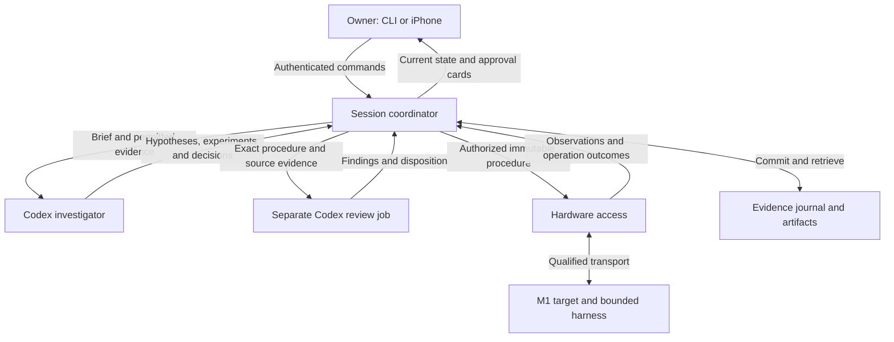

# M1 investigation tool — design

Revision: 2026-09-26, incorporating the independent Astra architecture review and the user's personal-lab security posture. **Implementation began in `the project checkout`; live hardware remains unqualified and disabled.** This is the current design reference. See the [implementation plan](M1%20investigation%20tool%20-%20implementation%20plan.md) and [requirements and gap audit](M1%20investigation%20tool%20-%20requirements%20and%20gap%20audit.md).

## 1. Purpose and scope

Build a host-controlled experimental workbench in which Codex investigates M1 power management, implements justified candidate changes, and evaluates them against physical evidence. The Linux ThinkPad T480 runs the entire control application. The MacBook Air M1 2020, J313/T8103, is the target reached through m1n1 and explicitly qualified experiment transports.

The workbench keeps a durable scientific record, lets Codex choose useful experiments, and executes only currently eligible procedures. Model belief cannot establish a hardware state, an approval, or a successful improvement.

Jev is entirely outside scope: no client, key requirement, configuration, packet format, evaluator, data recipient or roadmap item. Earlier research remains historical. The requested option to support another investigator provider later is retained as a small runtime interface; no second provider is implemented initially.

The first release includes the CLI, iPhone 12 mini owner interface, recovery/approval/budget controls, and at least one real investigation with multiple evidence-to-decision cycles. A well-supported bounded negative finding is a valid scientific result. An offline demonstration, missing prerequisite or inconclusive measurement does not count as completing that investigation.

A successful power patch must establish **at least 10% lower average screen-on idle power** in the declared native Linux fixture, reproduce on fresh confirmation data, and have no repeatable performance or responsiveness regression. Suspend/resume is a separate outcome, checked when affected. The three-hour session allowance is not a promise that discovery and confirmation fit one session.

## 2. Changes from the previous plan

- Prove transport, native result collection and measurement feasibility before substantial autonomous-loop and phone-interface work.
- Define an ephemeral target harness and separate native, proxy and hypervisor capabilities.
- Give Codex structured scientific jobs with evidence references and progress checkpoints.
- Separate human control, worker proposals and hardware execution through enforced process permissions.
- Bind builds, procedures, reviews, approvals and measurements to immutable revisions and target boot epochs.
- Specify accounting, crash reconciliation, time resets, offline behavior and maintenance.
- Separate exploration from confirmation and distinguish positive, below-target, negative, inconclusive and invalid results.

## 3. Host and target contract

The host performs research, builds, decoding, analysis, model calls, storage and UI delivery. Python is the main language for orchestration and analysis. Use explicit integer widths, units, endianness and clock domains when decoding data. C/C++ is reserved for target payloads or a measured host bottleneck; language choice does not establish measurement accuracy.

No target desktop, SSH, package manager, interactive shell or resident research agent is assumed. Host-prepared kernels, DTBs, initramfs images and bounded payloads are permitted through reviewed procedures. An image may contain a deterministic collector/workload harness; reasoning and orchestration remain on the ThinkPad. Persistent boot-policy or installed-system changes need separate setup/deployment approval.

| Target mode | Available work | Required proof before use |
|---|---|---|
| Disconnected/unknown | Host research, builds and stored-evidence analysis | No target dispatch |
| m1n1 proxy | Supported bounded memory/register/payload operations | Identity, boot epoch, matching builds and procedure capabilities |
| Hypervisor guest | Supported guest execution and tracing | Prepared guest, matching hypervisor, result channel, interrupt/reboot behavior and observer-effect characterization |
| Native Linux experiment | Real workload and power measurements | Exact image, native result channel, bounded harness, completion detection and return/recovery path |

Native Linux handoff shuts down m1n1 USB I/O; the proxy and hypervisor virtual UART cannot be assumed to remain available. A native transport must be demonstrated separately. A dedicated debug UART is documented; Linux gadget serial is a candidate only if the actual kernel, controller and cable support it. See [transport evidence](M1%20tool%20-%20transport%20and%20recovery%20evidence.md), [handoff source](https://github.com/AsahiLinux/m1n1/blob/main/src/main.c) and [serial-debug documentation](https://asahilinux.org/docs/hw/soc/serial-debug/).

The early hardware feasibility task selects and demonstrates an available native channel. Failure permits proxy/hypervisor mechanism research but blocks native power confirmation. Never substitute hypervisor power for native power.

### Ephemeral experiment harness

Each native image contains an immutable reviewed image manifest: source and artifact digests, configuration, workload/collector schedule, finite runtime, maximum output, result framing/checksums, completion marker and return behavior. A separate bounded launch manifest supplies the unique run ID, image digest and approved parameter values; the image does not embed its own final digest. The host validates both manifests against the approved procedure. The harness echoes the image and launch identities plus actual boot identity/configuration before collection and a complete/partial result manifest afterward.

Buffer bounded results where feasible; streaming during power trials needs observer-effect characterization. Lost RAM results remain lost/partial. No undeclared writes to the user's internal filesystem; storage export needs a named destination and reviewed write scope.

A native run may temporarily lack live control. Its approval states that fact, its autonomous deadline and available recovery. A host timeout cannot prove the target stopped. A target watchdog counts as protection only after qualification and cannot guarantee recovery from every SoC hang.

### Build and baseline provenance

Use isolated candidate worktrees. Record source commit plus dirty diff, toolchain/dependency versions, kernel configuration, DTB, firmware references, root filesystem, collector and output hashes. Build with the pinned tree's actual dependencies, including Rust where required by m1n1. Review the exact source/artifact manifest; a changed executable hash invalidates approval. Keep a known-good image and explicit revert path.

Select a current working Asahi baseline after reviewing upstream work. Compare reporting, device activity, wakeups and CPU-idle behavior before choosing a bounded question; do not assume PMP is the cause. macOS tracing needs separately prepared boot artifacts and is not an implicit first-release prerequisite. [Tethered boot](https://asahilinux.org/docs/sw/tethered-boot/), [M1 support table](https://asahilinux.org/docs/platform/feature-support/m1/)

## 4. Scientific workflow and information flow

Repeat **observe → explain → propose → select → review/authorize → execute → interpret → continue or conclude**. Codex chooses the scientific next step; the coordinator checks whether an operation is eligible now. Model output remains a proposal until validated and committed.

Maintain a small active set of hypotheses with source evidence, strongest counterevidence, predictions and unresolved assumptions. Several mechanisms can coexist; a missing explanation remains possible. Inactive branches remain retrievable without entering every prompt.

Each experiment states:

1. The bounded question and engineering decision it could change.
2. Competing explanations, control conditions and an inconclusive outcome.
3. Predicted observations and analysis rules recorded before collection.
4. The cheapest discriminating alternative and why the selected procedure is preferable.
5. Preparation, collection, analysis, reboot and recovery cost, with ranges where uncertain.
6. Dependencies, permissions, artifact/protocol revisions, abort conditions and next actions for plausible outcomes.

Inspect sources/existing captures first. Select one experiment at a time; combine captures only when interference is understood. Reuse approved procedures within scope. Reconsider at meaningful evidence changes or experiment completion, not per sample.

After two consecutive experiments fail to discriminate the same explanations, require a redesign checkpoint before repeating. This prevents unproductive loops; it is not a statistical stopping rule. Adequate contradictory evidence can close a branch. Budget exhaustion or missing hardware produces a resource/prerequisite stop.

### Codex jobs and memory

Use bounded jobs: investigate/plan, implement an artifact, analyze a capture, review a procedure, or write a conclusion. Inputs include objective, tools, evidence manifest, expected result schema and resource envelope. Outputs include job identity/status, findings, source/artifact references, proposed record changes, unresolved issues and requested next action. A malformed-output correction, retry or resume is admitted only through the same budget, stop and lease check as a new turn. One bounded correction attempt is allowed when resources and policy still permit it; repeated failure terminates the job with a recorded error.

Default concurrency: one primary investigator, up to two additional independent research/analysis/review jobs when resources fit, and one target operation. These are configurable owner limits. The coordinator schedules helpers; disable runtime features that spawn hidden jobs or autonomous continuations outside its ledger.

The journal remains authoritative across context compaction and runtime restart. New/resumed jobs receive the objective, branch, recent changes, failed attempts, approvals/budgets and relevant supporting/contradicting evidence. Summaries reference immutable records; screened full technical detail remains retrievable. Store concise rationale, not a requirement for private model reasoning. Fetched documents, source comments and target output are evidence, never permission-granting instructions.

## 5. Modules and process authority

| Module | Public interface | Hidden implementation |
|---|---|---|
| Session coordinator | Submit owner command/model proposal; query state/events | Lifecycle, scheduling, eligibility, approvals, budgets and recovery |
| Evidence journal | Commit records/artifacts; retrieve a versioned view | Transactions, provenance, revisions, durability, quota and export |
| Investigator runtime | Start/resume/interrupt a job; obtain events/result/usage | Local Codex adapter, isolation, context and reconciliation |
| Hardware access | Inspect capabilities; execute authorized procedure; reconcile outcome | Exclusive device access, mode-specific operations and bounded recovery |
| Operator interface | Display records; submit authenticated commands | CLI, browser UI, event replay, notifications and stale-state handling |

Use one persistent systemd-managed Python application for coordination, SQLite, budgets, CLI and the web interface. A small hardware helper exclusively owns target devices. Codex and build/analysis work run as bounded subprocesses. SQLite has one authoritative writer. No distributed queue, graph database, general workflow language or dynamically loaded model-written control code is needed.

Separate owner commands, worker proposals and hardware dispatch through application interfaces. Workers cannot turn model output into approval or call hardware directly. Runtime request IDs confer no hardware authority. CLI commands use the local application interface; browser commands use owner-only Tailscale ingress with revision and idempotency checks.

The hardware process owns the sole device handle and accepts typed, versioned operations from the coordinator. Dispatch includes operation ID, boot epoch, procedure/artifact digest, scope and deadline. Generic shell strings and arbitrary Python modules are not dispatch formats. New host instrumentation capabilities require reviewed installed adapter changes; target payloads use exact-artifact approval. Loader bounds constrain dispatch, not every possible effect of privileged target code.

### Isolation and outbound data

This is a single-owner personal lab. Apply proportionate controls against accidental model actions: workers have no sudo or target-device access, installed control code is outside their writable workspaces, and only the hardware helper receives typed dispatches from the coordinator. Keep credentials outside prompts, evidence and experiment workspaces. More elaborate identity, namespace or network separation is deferred unless qualification exposes a concrete need. [systemd execution controls](https://github.com/systemd/systemd/blob/main/man/systemd.exec.xml)

Outbound policy: **relevant technical evidence, including raw traces and code, may reach Codex; exclude credentials, personal data and unrelated private contents**. Default views contain selected sources and screened artifacts. Quarantine raw captures locally; capture known experiment buffers/ranges instead of unrelated memory. Minimize and scan content; scanners cannot prove arbitrary memory contains no private data. Ambiguous contents require local review/redaction. Retain released-evidence manifests without logging excluded secrets.

Treat model/build/fetch/decode output as data. Validate schemas, bound sizes and reject embedded commands/path traversal before promotion or dispatch. The coordinator and hardware helper do not execute arbitrary commands received in evidence.

## 6. Runtime integration

Use one Codex adapter backed by local app-server. Prefer the supported Python SDK, which wraps that transport; use stable app-server RPC behind the same interface if the pinned wrapper lacks needed behavior. Pin SDK, bundled runtime, configuration and selected model during readiness. [Codex SDK](https://learn.chatgpt.com/docs/codex-sdk), [app-server](https://learn.chatgpt.com/docs/app-server)

Required capabilities: persistent thread/job IDs, streaming status, structured results, terminal disposition, interruption, resume/reconstruction, usage and authentication health. Record actual capability support. Use the owner's supported login; secrets stay outside prompts/evidence. Account rate limits and login expiry are separate from the tool's allowance. No automatic credential/provider substitution.

Allowlist runtime methods. Shell/process endpoints that bypass the Codex sandbox must not be reachable through phone commands or model proposals. Disable unused apps, tools and nested scheduling; do not mix legacy sandbox configuration with permission profiles inadvertently. The [runtime evidence note](M1%20tool%20-%20Codex%20runtime%20evidence.md) describes required qualification and documented limits.

Owner chat is a scoped, budgeted Codex job. It can explain evidence and propose steering; only authenticated owner commands grant resources, change policy or authorize effects. Non-AI status and controls remain usable after budget exhaustion.

## 7. Records and durability

| Record | Required content |
|---|---|
| Session | Objective, owner, host/target, policy, lifecycle, allowance epochs and lifetime usage |
| Target snapshot | Identity, boot epoch, mode, configuration, capabilities, freshness and recovery readiness |
| Observation | Source, raw artifact, timestamps/clock domain, conditions, completeness and uncertainty |
| Derived result | Input observations, analysis version, units, calculation and uncertainty |
| Hypothesis/decision | Support/counterevidence, predictions, alternatives, choice and concise rationale |
| Measurement protocol | Fixture, outcome, sensor provenance, collection/analysis/stopping and regression rules |
| Experiment | Question, predictions, procedure/protocol revisions, cost and interpretation plan |
| Procedure | Typed operations, prerequisites, hashes, limits, abort, cleanup and recovery |
| Build manifest | Source/toolchain/configuration/input and output hashes |
| Review | Exact revision, initial independent assessment, findings and disposition |
| Approval | Owner, scope/revision, target/configuration conditions, repeat/expiry limits and revocations |
| Operation | Durable dispatch intent, boot epoch, outcome, partial results and reconciliation |
| Job/outbound manifest | Runtime/thread/turn IDs, released evidence, status, usage, version and policy |
| Owner command | Identity, unique ID, expected revision, received/applied status and outcome |

Use stable IDs and immutable revisions. Append corrections instead of overwriting evidence. A boot/reboot changes the boot epoch; reconnect alone proves neither a reboot nor persistence of prior state. Unknown state requires reconciliation.

Persist intent before dispatch. An intent without a conclusive outcome is an unknown effect, including a crash between physical execution and journaling. Unique IDs prevent duplicate application submissions, not all duplicate USB effects. Observe through eligible procedures to reconcile; never blindly replay a mutating operation.

Use local SQLite with WAL and FULL synchronous commits for authoritative transitions. Stage, flush and atomically publish artifacts with hashes/sizes before a transaction marks them available. Reconcile orphan files, missing artifacts and partial captures after restart. Keep reserved disk space for journal/cleanup operations. [SQLite WAL durability](https://www.sqlite.org/wal.html)

Back up a consistent database snapshot plus referenced immutable artifacts, using an appropriate SQLite backup mechanism. Copying only the main file while WAL is active is insufficient. Backup/export destinations are owner-selected and private; no cloud upload is implied. Include restore rehearsal in implementation acceptance. Compress captures and clean temporary builds automatically; research-evidence deletion needs owner action. [SQLite backup](https://www.sqlite.org/backup.html)

## 8. Review, approval and eligibility

New target procedures receive structural checks and a separate Codex review job. The reviewer assesses exact artifacts/source evidence before seeing the author's preferred conclusion, then records blocking issues, nonblocking concerns or acceptance. This catches possible mistakes; it is not physical confirmation or guaranteed model independence.

Blocking findings require correction or resolving evidence before eligibility. Nonblocking disagreements stay visible. Changes to executable/effects/bounds/prerequisites invalidate affected reviews and approvals; measurement/analysis changes invalidate affected results. Description-only edits can retain the executable revision with an audit entry.

| Action | Default authority |
|---|---|
| Scoped host research/build/analysis | Automatic within job policy and budgets |
| Established observation with understood effects | Automatic after review and prerequisites |
| New target-state-changing procedure | Exact owner approval after review |
| Approved repeat | Automatic within scope, configuration and repetition limits |
| Persistent setup/boot/install/deployment change | Separate exact owner approval |
| Unsupported recovery or unmet prerequisite | No dispatch; request missing preparation |

Unknown MMIO read effects are not harmless observation. Cards show operations, expected benefit, failure severity, uncertainty, risk evidence, review findings, actual recovery steps, physical attendance and expiry. Use evidence-backed categories; never label model confidence a recovery probability. Recovery can be documented, demonstrated here, or invalidated.

Dispatch atomically checks review, approval, hashes, target/boot/configuration, prerequisites, limits, budget reservations and stop/revocation state. A stale card cannot approve another revision. Conversational confirmation must resolve to an exact card through the owner channel; model-generated approval text has no authority.

## 9. Recovery and unattended operation

Record separate recovery levels: reconnect/inspect, responsive software reboot, independent reset/physical intervention, and boot/firmware recovery. A reboot depending on the hung subsystem is not independent recovery.

Ordinary ThinkPad USB does not establish USB-PD hard-reset capability. Apple-supported DFU requires another Mac, which is not available. Linux restore tooling is a documented candidate, not proven recovery on this setup. Firmware restore is never an automatic retry. [Recovery evidence](M1%20tool%20-%20transport%20and%20recovery%20evidence.md), [Apple requirements](https://support.apple.com/en-us/108900)

Default experiments use temporary artifacts and established operating limits. Procedures with plausible permanent damage or boot/firmware consequences remain ineligible until their specific preparation/recovery requirements and exact owner approval are satisfied. Missing DFU access does not forbid ordinary proxy observations.

Unattended operation means continuing eligible work or stopping honestly for assistance. Before an operation, enforce physical-attendance conditions from its approval. Automatic recovery is restricted to approved procedures demonstrated in the relevant setup, with bounded attempts. Do not promise recovery from every hang.

## 10. Lifecycle, interruption and retries

Keep session, job and target state separate. Session phases: preparing, investigating, awaiting review/approval, executing, interpreting. Dispositions include paused, recovering, budget exhausted, completed and stopped. Model-job completion does not mean target completion.

| Event | Required behavior |
|---|---|
| Steering | Durable mailbox; apply at safe checkpoint and show application status |
| Pause | Stop admission; settle active work through approved checkpoint/cleanup; then pause |
| Stop/revoke | Immediately inhibit new dispatch, interrupt eligible jobs, run predefined cleanup and report target condition |
| USB loss | Bounded reconnect/re-identification/reconciliation; preserve unknown effects |
| Host/coordinator restart | Acquire sole control; reconcile surviving jobs, usage, intent, artifacts and target before work |
| Runtime outage/rate limit | Bounded idempotent retry then explicit wait; no provider switch or new target decision |
| Phone/Tailscale disconnect | Host continues eligible work; pending approvals stay pending |
| Disk/thermal/power fault | Stop admission and perform only qualified response/cleanup |

Default maximum is two automatic attempts for a documented transient read/fetch or job-start failure, with backoff and total deadline, subject to the common admission check. Resume existing handles before replacing jobs; a polling timeout is not termination. Mutating target operations require reconciliation, not generic retry. Procedure-specific timeout/cleanup bounds take precedence.

Run independently of terminal/browser lifetime, with host-process watchdog and bounded shutdown behavior. Lab mode inhibits sleep on AC, including approval waits; qualify actual lid behavior. Release inhibition when lab mode ends. AC loss stops admission; urgent battery/thermal/shutdown events use the qualified response. Forced power loss can interrupt cleanup. [systemd inhibitors](https://github.com/systemd/systemd/blob/main/docs/INHIBITOR_LOCKS.md)

## 11. Budgets and accounting

Default: **3 active hours or 100 million Codex tokens, whichever comes first**. This is a ceiling, not a consumption target. Show wall time, remaining resources and next-step estimates.

Active time uses a monotonic clock while research, jobs, builds, experiments, analysis or cleanup run. Explicit pauses/approval waits stop it after active work settles. Chat during a wait is counted work. Across restart retain clock segments plus UTC/boot IDs; disclose/reconcile uncertain gaps conservatively. Concurrent jobs do not multiply elapsed hours.

Count provider-reported Codex input plus output across investigator, helpers, reviewers, chat, summaries, compaction and retries. Cached-input/reasoning-output subsets are not added again. Deduplicate runtime/thread/turn updates; reconcile cumulative counters with deltas/high-water marks. Resume does not reset usage. Missing crash usage blocks new model work until reconciled or bounded by evidence; a guessed reserve is not sufficient. Continuing requires either a defensible upper bound recorded in the ledger or an explicit owner allowance decision that preserves the uncertainty and its possible overrun.

Reserve estimated tokens/time and cleanup headroom before work. Apply the admission check before every turn, correction, retry, resume and owner-chat request. Update estimates from observed jobs and bound concurrency near limits. A runtime without a hard per-turn cap supports an operational allowance, not exact zero-overshoot billing. At the threshold, stop admission and request interruption of active AI jobs, then reconcile terminal events and surviving processes; record unavoidable in-flight work as overrun. Perform only predefined non-AI cleanup afterward.

Every admitted AI job has a coordinator lease, an absolute deadline and a process-group/cgroup cleanup policy enforced by the host supervisor. If the coordinator disappears or loses its lease, the supervisor prevents the runtime from continuing indefinitely and records usage as unknown until reconciled. The coordinator never automatically restarts a paid turn solely because polling stopped.

The owner can add an editable token increment, extend time, or reset remaining active time to a custom duration. Record new allowance epochs and preserve lifetime usage. These controls need no model call. Resource grants do not restore invalid approvals or skip recovery. Future providers require explicit activation and allowance policy; fallback cannot bypass an exhausted budget.

## 12. Measurement and scientific acceptance

Each trial references a frozen protocol. Primary outcome: whole-device average power for a declared **native Linux screen-on idle fixture**. Specify desktop/display workload, brightness/refresh, lid, radios, peripherals/services, thermal/stability conditions, state of charge, charging/USB paths, software and collector. A minimal framebuffer fixture supports a claim only about that fixture.

Inventory sensor units, cadence, sign, driver origin, derived values, noise and energy boundary. Battery discharge, DC input and wall input differ. Current driver source derives some energy fields from charge/nominal voltage; charging limits and idle counters do not measure whole-device draw. Verify the actual target driver. [Measurement evidence](M1%20tool%20-%20measurement%20evidence.md), [Linux power-supply class](https://kernel.org/doc/html/next/power/power_supply_class.html)

Pilot collector and USB/tracing effects. Account for all energy paths; inhibiting charging does not prove USB supplies no load. Prefer verified battery discharge for a battery-life claim. An external instrument is requested if necessary and must match the boundary/resolution. Telemetry-changing patches require an unaffected confirmation measurement path.

Compute average power as energy over time or time-weighted integration of valid samples. Preserve clock domains, missing data, dropouts and predefined rejection reasons; no zero-filling. Choose duration and independent trial count from pilot variability and required precision.

Separate adaptive **exploration** from **confirmation**. Before fresh confirmation, freeze candidate, fixture, analysis, sample size, exclusions and decision rule. Default to randomized matched baseline/changed order within blocks, reset/warm-up and a revert check. Trial/block results are replicates; adjacent polls are correlated. Changed candidates/analysis require new confirmation data. Preserve every attempt and define multiplicity/selection handling before promoting a successful candidate after repeated confirmations, not only before family-wide claims. A policy may reserve one untouched final confirmation for a frozen winner or adjust the claim across all attempted candidates; record it before confirmation. [NIST blocking](https://www.itl.nist.gov/div898/handbook/pri/section3/pri332.htm), [autocorrelation](https://www.itl.nist.gov/div898/handbook/eda/section3/eda35c.htm)

**New design default:** establish the target only when the lower bound of a predeclared 95% uncertainty interval is at least 10%, including material sensor uncertainty, and regressions pass. A 12% estimate with a 2–22% interval is inconclusive about the target. Select a reviewed paired/block method appropriate to pilot data and baseline-denominator uncertainty. Use a fixed confirmation batch and final decision analysis. Safety/quality checks may stop runs without promoting favorable partial results.

Fresh trials reproduce a result; they do not independently calibrate a shared sensor. Sensor/method corroboration is a separate claim. Model agreement supplies neither.

Freeze throughput, idle-to-work latency, interactive/display latency and affected functional/device checks. Add suspend/resume where relevant. Repeatable degradation blocks adoption. Inadequate sensitivity leaves that dimension unverified; a nonsignificant result does not prove no regression. Pilot work sets detectable bounds without silently allowing slowdown.

| Outcome | Meaning |
|---|---|
| Validated improvement | Frozen power/uncertainty and regression contract passes on fresh confirmation |
| Below target | Adequate data bound improvement below 10%; a smaller benefit may exist |
| Bounded negative | A named prediction fails under specified conditions and adequate resolution |
| Inconclusive | Precision/conflict/missing observations prevent a decision |
| Invalid | Protocol/prerequisite/capture validity failed; preserve evidence |
| Resource/prerequisite stop | Work could not continue; not a scientific negative |

Preserve all candidate patches as research artifacts. Only a validated candidate is recommended for deployment under the agreed goal; deployment needs separate owner approval.

## 13. iPhone and CLI experience

Four phone views: session overview, experiment/evidence, approvals/recovery, and conversation. Budget controls and pause/stop stay reachable. Use compact summaries with expandable detail, readable touch targets and no horizontally scrolling approval form.

One owner uses Tailscale-only private HTTPS. Bind locally, restrict tailnet access and trust identity headers only through controlled ingress. Reject missing/unrecognized identities, including tagged-device cases unless separately configured. Worker namespaces cannot reach the local backend to forge headers. State changes require origin/CSRF checks, owner identity, expected revision and unique command IDs. No public Funnel. [Tailscale Serve](https://tailscale.com/docs/features/tailscale-serve)

SSE provides live status with durable cursors and snapshot refresh after gaps. Show connection and last-update state. Commands return received/applied/rejected status; a tap does not prove execution. Offline approvals are never queued for automatic submission. Cache only the static application shell; sensitive records and actionable cards require current authentication/state.

Provide Home Screen installation and permission-based push for approvals, recovery, budgets and completion. Generic notifications open the current record; dismissal does nothing. Qualify actual iOS support/enrollment. APNs transport differs from private application access. Delivery is best effort; authoritative pending state remains visible after reconnect. [WebKit Web Push](https://webkit.org/blog/13878/web-push-for-web-apps-on-ios-and-ipados/)

Controls: start, checkpoint steering, approve/deny/revoke, pause/resume/stop, token additions, custom time extension/reset, evidence inspection/export and Codex chat. Code editing/host administration use the ThinkPad. Closing the browser does not stop the host.

## 14. Installation, maintenance and deferred work

Default stack: Python, local Codex SDK/app-server adapter, SQLite/artifact directory, FastAPI with server-rendered HTML and a small TypeScript client, SSE, and CLI sharing the command interface. Package pinned dependencies and a systemd-managed installation with necessary identities/permissions.

Installed control code is read-only to workers. Jobs may propose changes in isolated checkouts but cannot activate them. Updates require a settled session, consistent backup, schema compatibility/migration record and rollback plan. No self-update during an experiment. Local recovery instructions must work when the UI/runtime is unavailable.

Defer general provider orchestration, distributed scheduling, learned selection policies and automatic utility optimization. Add instruments/reset adapters only for a demonstrated need. No purchase or infrastructure change is authorized by this plan.

The user lifted the implementation hold. Host-only implementation may proceed; live target access, model spending and persistent target changes remain subject to their explicit qualification and approval gates.
